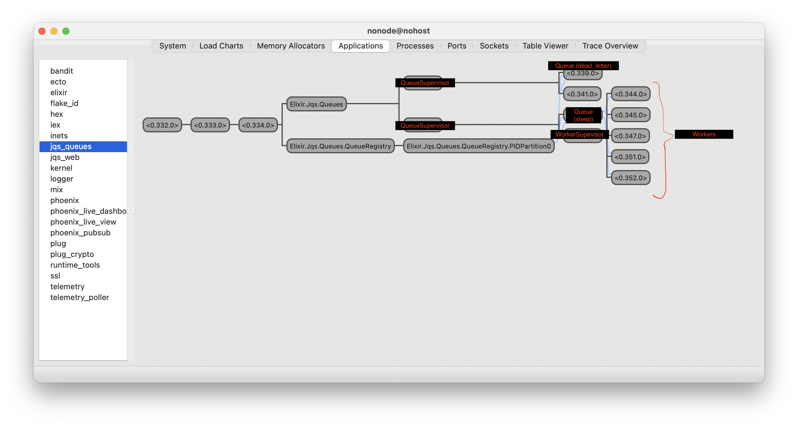

# JQS

Jqs (Jonathan's Task Queue) is an asynchronous task queue implementation and API written for the V7 Labs Backend Elixir technical test.
It fulfils all of the core requirements as well as two of the optional requirements (concurrency limiting and retry backoff).
It does not implement persistence.

## Usage

The queue can be started with `docker-compose up`. An API will be served on port 4000 once the container has been started.
You can then create a new task in the task queue with the following example request:

```
curl --location 'http://localhost:4000/api/tasks' \
--header 'Content-Type: application/json' \
--header 'Accept: application/json' \
--data '{
    "queue": "sleep",
    "context": {
        "timeout": 5000
    },
    "options": {
        "max_retries": 2,
        "backoff_ms": 2000,
        "priority": "high"
    }
} '
```

All properties under `options` are optional and have defaults (3 retries, 1000ms backoff, low priority).
The `queue` is required.
The request body is validated and errors will be returned on bad requests however the task context is not validated and will be passed to the worker unprocessed.
Invalid contexts may cause the job to fail however.

You can also start the task queue with `mix deps.get` and `mix phx.server` if you are having problems with Docker.

## Configuration and extendability

Queues are configured in the `config/config.exs` file and currently there is a single queue called sleep which is implemented in `apps/jqs_queues/lib/queues/workers/sleep.ex`.
Jqs supports an arbitrary number of different queues and allows using the same worker implementation for different queues.
Each queue is implemented as a priority queue with two possible levels of priority (high and low).
A queue has a concurrency level which is the number of workers it has in its worker pool and the number of tasks it can execute concurrently.

Implementing a new type of worker is straightforward and only requires `use`ing `Jqs.Queues.Worker` in your new module and implementing a `perform/1` function that accepts the task definition.

Tasks will be retried when they fail (up to `options.max_retries` which is by default 3) and an optional _minimum_ backoff time can be specified in milliseconds.
The task will be added to the back of the priority queue when it fails/after the backoff time has passed.
The task will be sent to the `dead_letter` queue if it fails more than the configured `max_retries`.

## Architecture

The project is split into two apps according to the umbrella pattern.

### The API

The JSON API is implemented using the phoenix framework in the `jqs_web` app. A single endpoint exists at `/api/tasks` which can be used to create new tasks in the task queue - example usage is above.
Client requests are validated using an `Ecto` schema and appropriate error messages will be returned if the request is invalid based on the contents of the Ecto Changeset.
The Ecto schema can be found in the `validators/task_create.ex` file.

### The Asynchronous Task Queue

The task queue is implemented in the `jqs_queues` app.
Each `Queue` is started (with permanent restarts) under a `QueueSupervisor` which supervises both the `Queue` as well as the `WorkerSupervisor` (which unsurprisingly supervises the worker pool).
You can see this layout in the screenshot below.
During initialisation, the `Queue` will register itself in the [QueueRegistry](apps/jqs_queues/lib/queues/queue_registry.ex) which uses Elixir's `Registry` module.
All further access to the `Queue`, for example when enqueueing a task, will happen by first looking up the `Queue` pid in the Registry by its name.
By using a registry based on [ETS](https://hexdocs.pm/elixir/main/ets.html) we can avoid having a single process bottleneck for all queues.

The `WorkerSupervisor` itself is started (under the `QueueSupervisor`) by the `Queue` which will then manage it through its lifetime.
Likewise, `Worker` processes are started by the `Queue` process under the `WorkerSupervisor`.
The `Queue` will always restart crashed `Worker` and `WorkerSupervisor` processes and then mark any tasks that were being processed under them as failed.

The `Queue` itself is implemented in `apps/jqs_queues/lib/queues/queue.ex` and this is where you will find the main logic of the task queue implementation.
The `Queue` module is implemented as an elixir `GenServer`.
It has a very basic public interface with only two functions: `enqueue/2` which allows clients to add new queues to the queue and `task_complete` which allows workers to report successful completions of tasks.

Task failures are recorded by listening to `:EXIT` signals from the worker which are received when the worker process crashes.
A crash can either occur naturally during the performance of the task or if the `perform/1` function returns anything except `:ok`.
JQS follows the Elixir/Erlang philosophy of [Let it Crash](https://wiki.c2.com/?LetItCrash) and `Worker` crashes are an expected part of the task processing lifecycle.
Instead of trying to avoid and handle all errors - we allow them to happen and handle the crashes gracefully.

#### The Priority Queue

The `PriorityQueue` module which decides the order that tasks are performed supports tasks with `high` and `low` priority. It is built on Erlang's `queue` module which provides efficient FIFO capabilities (unlike a normal `List`). I decided to go for a simple implementation with only two priorities so that I could focus my time on the asyncronous task processing. The implementation is hidden behind simple `enqueue` and `dequeue` functions and the priority queue could be upgraded to support an arbitrary number of priorities without changing the interface too much.

#### Task backoff
Task backoff is handled using Elixir's `Process.send_after`. A copy of the task is stored in `state.backing_off_tasks` and once the `send_after` timer has completed the task will be requeued for processing.

#### The Dead Letter Queue

Once a task has reached its maximum number of retries it will be sent to the "dead letter" queue. This is implemented as a normal `Queue` except that it has zero concurrency, no worker module and is started automatically without configuration.

### The jqs_queues supervision tree from the Erlang observer



## Testing

Run `mix test` to run the test suite. All tests should pass.

## Limitations

The queue makes a best effort to recover from any and all crashes however it does not support persistence so permanent state loss is possible if the `Queue` module crashes. Efforts have been made to prevent this such as ensuring that GenServer calls to workers are wrapped in try/catch blocks and performing basic validation on tasks that are enqueued.

The queue does not support task results or fetching the status of the task after it has been submitted. This would be a standard feature in a normal task processing queue but was out of scope for this technical test which focusses on the asyncronous processing itself.
